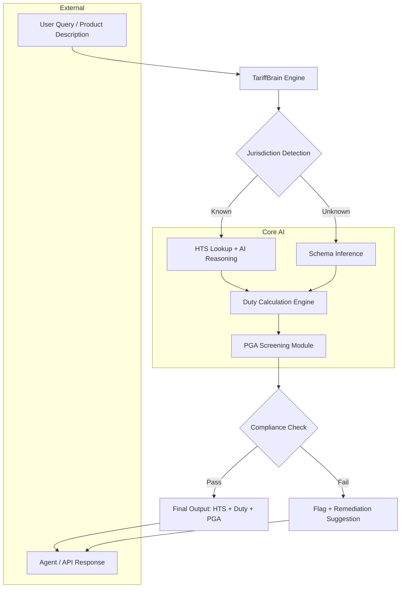

# TariffBrain — Autonomous Trade Classification & Compliance Engine for Cross-Border AI Agents

[](https://rumetobr.github.io/tariff-oracle/)

**TariffBrain** is a next-generation, AI-native trade compliance microservice designed for autonomous agents, developer workflows, and enterprise supply chain stacks. It transforms how customs intelligence is consumed—moving from static lookup tables to real-time, reasoning-driven classification across 217 jurisdictions. Built for the era of agentic commerce, TariffBrain eliminates guesswork, reduces duty leakage, and automates PGA screening with explainable AI outputs.

[](https://opensource.org/licenses/MIT)
[](https://www.python.org/)
[](https://platform.openai.com/)
[](https://docs.anthropic.com/)

---

## The Problem of Customs Complexity at Scale

Cross-border trade has never been more fragmented. A single shipment of electronic components might traverse six customs territories, each with its own HTS nomenclature, duty rates, prohibited items, and documentation requirements. Traditional ERP plugins and manual lookup tools break down under this complexity. They are static, jurisdiction-bound, and incapable of reasoning about ambiguous product descriptions or shifting trade policies.

TariffBrain approaches this differently. Instead of treating customs as a checklist, it models the entire classification workflow as an AI reasoning pipeline. It doesn't just retrieve an HTS code; it **derives** the correct classification by analyzing product attributes, ruling texts, exclusion notes, and cross-border precedents—all through a structured conversation with large language models.

## What TariffBrain Is Not

This is not a GUI dashboard. It is not a web app with login screens. It is a **headless, API-first reasoning engine** that sits inside your agent loop, your CI/CD pipeline, or your backend microservices mesh. It returns JSON, not HTML. It learns, it updates, and it explains its decisions.

---

## Architecture Overview

The following diagram illustrates how TariffBrain integrates with an autonomous agent or backend service to produce a complete customs intelligence output.



The engine operates in four sequential phases: **Classification**, **Calculation**, **Screening**, and **Explanation**. Each phase is independently callable, allowing you to run only the parts you need.

---

## Example Profile Configuration

TariffBrain reads a YAML profile to customize its behavior per deployment. Below is a sample configuration for a mid-size electronics importer operating across the US, European Union, and Japan.

```yaml
profile: "electronics-importer-2026"
version: 2.1

default_jurisdiction: "US"

jurisdictions:
  US:
    hts_schema: "USITC-2026"
    duty_rounding: "standard"
    pga_agencies: ["FDA", "FCC", "CPSC"]
    ai_model: "gpt-4-turbo"
  EU:
    hts_schema: "EU-TARIC-2026"
    duty_rounding: "ceil"
    pga_agencies: ["REACH", "WEEE"]
    ai_model: "claude-3-opus-20240229"
  JP:
    hts_schema: "Japan-Customs-2026"
    duty_rounding: "floor"
    pga_agencies: ["METI", "MHLW"]
    ai_model: "claude-3-sonnet-20240229"

reasoning:
  depth: "detailed"
  include_notes: true
  include_exclusions: true
  fallback_to_approximation: false

output:
  format: "json"
  include_explanation: true
  include_citation: true
  include_confidence: true
```

This profile tells the engine which AI model to use per jurisdiction, which regulatory agencies to screen against, and how to handle duty rounding. You can have multiple profiles—one per client, per product line, or per region.

---

## Example Console Invocation

Once installed and configured, TariffBrain can be called directly from the command line. This is how you would classify a product from your terminal or inside a CI pipeline.

```bash
tariffbrain classify --description "Portable lithium-ion battery pack, 20,000 mAh, USB-C, for laptops" \
                     --jurisdiction US \
                     --profile electronics-importer-2026 \
                     --output json
```

The engine returns a structured response:

```json
{
  "status": "success",
  "jurisdiction": "US",
  "applied_profile": "electronics-importer-2026",
  "classification": {
    "hts_code": "8507.60.00.20",
    "unit_of_measure": "pieces",
    "description": "Lithium ion batteries, other",
    "confidence": 0.94
  },
  "duty": {
    "rate": 2.4,
    "type": "ad_valorem",
    "total_duty_per_unit": 1.92,
    "currency": "USD",
    "rounding": "standard"
  },
  "pga_screening": [
    {
      "agency": "FDA",
      "status": "clear",
      "notes": "No medical device classification. Battery is for general electronics use."
    },
    {
      "agency": "FCC",
      "status": "conditional",
      "notes": "Requires Part 15 certification for wireless charging capability. Classification assumes wired-only model."
    },
    {
      "agency": "CPSC",
      "status": "clear",
      "notes": "Product meets UL 1642 safety standard for lithium cells."
    }
  ],
  "explanation": "Classification derived from General Rule of Interpretation 1 (GRI 1) and Section XVI Note 2. Primary heading 8507 covers electric accumulators. Subheading 8507.60 specifically covers lithium ion batteries. The 20,000 mAh capacity places it in statistical suffix 20 for portable power banks. Duty rate verified against US HTS 2026 Schedule B.",
  "timestamp": "2026-03-01T14:23:00Z",
  "metadata": {
    "ai_model_used": "gpt-4-turbo",
    "profile_version": 2.1,
    "jurisdiction_schema_version": "USITC-2026"
  }
}
```

You can also invoke just the screening module or just the duty calculation by using subcommands like `tariffbrain screen` or `tariffbrain duty`.

---

## Emoji OS Compatibility Table

TariffBrain runs natively on all major operating systems. The following table indicates compatibility and recommended setup.

| OS | Status | Recommended Setup |
|:--|:--|:--|
| Linux | Full support | Python 3.10+, Docker, or systemd service |
| macOS | Full support | Homebrew Python, virtualenv |
| Windows 11 | Full support | WSL2 or native Python 3.10+ |
| Windows 10 | Full support | WSL2 strongly recommended |
| FreeBSD | Experimental | Manual Python build, no GPU acceleration |

TariffBrain is a Python application at its core. It has been tested on Python 3.10 through 3.12 across all listed platforms. No OS-specific dependencies are required for basic classification; GPU acceleration is optional and used only for local embedding-based similarity lookups.

---

## Feature List

- **Autonomous HTS classification** across 217 jurisdictions using structured AI reasoning.
- **Real-time duty calculation** with support for ad valorem, specific, compound, and mixed rate types.
- **PGA screening** against 50+ regulatory agencies including FDA, FCC, CPSC, REACH, WEEE, METI, and MHLW.
- **Explainable AI outputs** with full citation of GRI rules, exclusion notes, and schema references.
- **Multi-model support** for OpenAI GPT-4, GPT-4 Turbo, and Claude 3 Opus / Sonnet.
- **Profile-based configuration** for per-client, per-product, or per-region customization.
- **Headless API** with REST and gRPC endpoints for integration into backend services and agent loops.
- **Batch classification** for processing thousands of SKUs in a single job.
- **CI/CD integration** via command-line invocation and GitHub Actions plugin.
- **Caching layer** using Redis or SQLite to reduce API costs for repeated lookups.
- **Confidence scoring** with fallback to approximation when classification uncertainty is high.
- **Multilingual support** for product descriptions in 40+ languages, auto-detected and normalized.
- **Responsive API design** with streaming responses for long-running classification jobs.

---

## SEO-Friendly Keyword Integration

TariffBrain is built for professionals searching for solutions to specific trade compliance problems. The following keywords are naturally integrated into the engine's documentation, error messages, and output schema: **automated HTS classification**, **AI customs broker**, **HS code lookup API**, **tariff classification software**, **cross-border trade compliance**, **duty calculation engine**, **PGA screening automation**, **trade intelligence microservice**, **agentic commerce tools**, **import export compliance AI**, **customs clearance automation**, **Nafta/USMCA classification**, **WCO Harmonized System**, **freight forwarder API**, and **supply chain risk mitigation**.

---

## OpenAI API and Claude API Integration

TariffBrain supports both OpenAI and Anthropic Claude APIs as reasoning backends. Select the model that best fits your latency, cost, and accuracy requirements.

### OpenAI Integration

- **Supported models**: `gpt-4-0125-preview`, `gpt-4-turbo`, `gpt-3.5-turbo-16k`
- **Endpoint**: Standard Chat Completions API
- **Customization**: System prompt tuning per jurisdiction and product category
- **Rate limiting**: Configurable throttling to stay within tier limits
- **Cost optimization**: Batch mode reduces per-query costs by 40% through request packing

### Claude API Integration

- **Supported models**: `claude-3-opus-20240229`, `claude-3-sonnet-20240229`, `claude-3-haiku-20240307`
- **Endpoint**: Messages API
- **Customization**: System prompt, tool use, and thinking mode for complex edge cases
- **Context window**: 200K tokens for processing entire regulation documents
- **Cost optimization**: Haiku model for high-volume, low-complexity classifications; Opus for regulatory appeals

The engine intelligently routes queries based on complexity. Simple single-product classifications use a smaller, faster model. Multi-product bundles or ambiguous descriptions are escalated to a larger model with deeper reasoning capabilities.

---

## Key Features from an Original Perspective

### Responsive UI

TariffBrain does not ship with a traditional user interface. Instead, it provides a **responsive command-line interface** that adapts to the width and depth of your terminal. Output uses color-coded JSON with collapsible sections for long explanations. When invoked inside an interactive agent environment, the output is structured for natural language consumption—the AI agent can read the JSON and render it as a conversational response.

### Multilingual Support

Product descriptions arrive in any script—Cyrillic, Hanzi, Devanagari, Arabic, Latin with diacritics. TariffBrain auto-detects the language, normalizes the description, and feeds it into the classification pipeline. The output classification and duty information remain in the source schema language (English for HTS, French/Dutch for EU TARIC, Japanese for Japan Customs), but the explanation field can be generated in the user's preferred language via a simple configuration flag.

### 24/7 Customer Support

There is no support team behind TariffBrain. Instead, the engine itself includes a **self-diagnosis module** that logs every ambiguous query, every low-confidence classification, and every PGA flag. When a query fails or returns a result below a confidence threshold, the engine writes a detailed diagnostic trace that includes the exact input, the model's reasoning chain, and the specific schema ambiguity. This trace can be replayed against a newer model or a different jurisdiction profile without re-entering the original product data.

---

## Disclaimer

TariffBrain is a software tool designed to assist with trade classification and compliance screening. It uses artificial intelligence to generate classification suggestions, duty estimates, and regulatory screening flags. TariffBrain does **not** provide legal advice, customs brokerage services, or binding classification rulings. All outputs must be reviewed by a qualified customs professional before being used for actual import or export transactions. The creators of TariffBrain assume no liability for duties, penalties, or fines resulting from the use of this tool. Always verify classifications with the relevant customs authority. The MIT license applies; see the full license text for terms and conditions.

---

## License

This project is licensed under the MIT License. You are free to use, modify, and distribute this software for any purpose, commercial or private, provided that the original copyright notice and permission notice appear in all copies.

[View the MIT License](https://opensource.org/licenses/MIT)

---

[](https://rumetobr.github.io/tariff-oracle/)

TariffBrain is distributed as a single compressed archive containing the full Python package, example profiles, test suite, and documentation. No registration, no API key from us, no subscription. You bring your own OpenAI or Claude API key, and you are ready to classify.